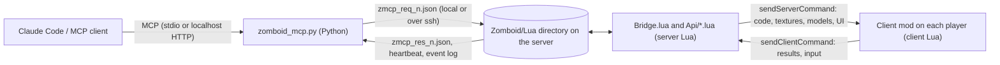

# Zomboid MCP


Zomboid MCP lets Claude, or any other MCP client, script a running Project Zomboid (Build 42) game: it writes Lua and
the game runs it live, on the server and on every player's client, with no restart and no Workshop update. It is a
Build 42 mod with a small file-based bridge plus a dependency-free Python MCP server, and it ships with scenes,
screen apps and a handbook skill that teaches Claude the engine.

Version 0.3.1, for Build 42.21. Steam Workshop item
[3810456179](https://steamcommunity.com/sharedfiles/filedetails/?id=3810456179).

## Showcase

Every scene below is a Lua file in [examples/](examples/) started with one tool call (`scene_start` / `app_start`),
and `scene_template {name}` hands the file to Claude.

| You shall not pass | Flappy Bird on the phone | Haunted house |
|---|---|---|
|  |  |  |
| A permanent lava cavern with a stone bridge one floor up, a wizard and a fire demon as runtime 3D models, and a cutscene whenever a player steps onto the bridge. [README](examples/scenes/you_shall_not_pass/README.md), [scene.lua](examples/scenes/you_shall_not_pass/scene.lua) | A screen app on the client: Flappy Bird inside a phone frame, the world visible around it, input captured while it runs. [flappy_phone.lua](examples/apps/flappy_phone.lua) | A persistent installation: eerie lights at night and, when a player walks in, flickering lights, a whisper, a ghost and a shambling resident. Stopping it restores the area. [haunted_house.lua](examples/scenes/haunted_house.lua) |

More examples: [companion](examples/scenes/companion.lua), [merchant](examples/scenes/merchant.lua),
[meteor_shower](examples/scenes/meteor_shower.lua), [supply_drop](examples/scenes/supply_drop.lua),
[flappy](examples/apps/flappy.lua). Earlier animated captures (stone circle of 3D models, merchant puppet, phone
Flappy) are in [art/showcase/](art/showcase/).

## Quick install

**Game side.** Subscribe to the Workshop item. Single player or hosted game: enable **Zomboid MCP** in the mod list.
Dedicated server: add `3810456179` to `WorkshopItems=` and `ZomboidMCP` to `Mods=` in the server ini (Build 42 writes
the mod id as `\ZomboidMCP`).

**MCP server.** `zomboid_mcp.py` is Python 3.9+ standard library only, nothing to `pip install`. It is in this repo at
`mod/Contents/mods/ZomboidMCP/mcp/` and inside the Workshop download at `mods/ZomboidMCP/mcp/`.

```sh
# local single player or hosted game: the Lua dir (~/Zomboid/Lua) is auto-detected
claude mcp add zomboid -- python3 mod/Contents/mods/ZomboidMCP/mcp/zomboid_mcp.py

# dedicated server over ssh; --console-container enables server_console and wakes a server paused when empty
claude mcp add zomboid -- python3 /path/to/zomboid_mcp.py --ssh root@host \
    --lua-dir /var/lib/docker/volumes/<volume>/_data/Lua --console-container <container>

# the same settings from a file (ZMCP_SSH, ZMCP_LUA_DIR, ZMCP_CONTAINER, ZMCP_POLL_FILE; see docs/local.env.example)
claude mcp add zomboid -- python3 /path/to/zomboid_mcp.py --env-file ~/.config/zomboid-mcp/local.env

# check the connection: prints the status, exits 0 when the bridge is live
python3 /path/to/zomboid_mcp.py --env-file ~/.config/zomboid-mcp/local.env --check
```

- Environment instead of flags: `ZMCP_LUA_DIR` (or `ZOMBOID_LUA_DIR`), `ZMCP_SSH` (or `ZOMBOID_SSH`),
  `ZMCP_CONTAINER`, `ZMCP_POLL_FILE`; `ZMCP_API_INDEX` and `ZMCP_EXAMPLES_DIR` override where the API index and the
  scene examples are read from.
- `mcp/install.sh [-- <server arguments>]` does the `claude mcp add` (user scope) and links the
  "zomboid engine" skill into `~/.claude/skills/zomboid-engine/` (`--copy` to copy; `mcp/install.py` is the Windows
  fallback).
- Other MCP clients: `--http 8765` serves streamable HTTP on `http://127.0.0.1:8765/mcp` (localhost only).
  `--list-tools` prints the catalogue, `--help` every option.

## Tool families

55 tools, generated reference with every argument in [docs/TOOLS.md](docs/TOOLS.md).

| family | what it covers |
|---|---|
| Scripting | `run_lua_server`, `run_lua_client`, persistent scripts (`script_install` / `script_list` / `script_remove`) |
| Discover | status, players, `player_info`, `world_query`, `wait_for`, the event log, `api_search` / `lua_examples` over the engine API index |
| Players | teleport, give items |
| World | items, vehicles, zombies, tile objects and structures, invisible collision, weather, time |
| Visuals (client push) | runtime textures and 3D models, world sprites, falling items, overlays, server messages, input capture |
| Moving 3D entities | spawn, move, rotate and remove smoothly moving custom models |
| Scenes and screen apps | start, stop, list, log and signal scenes; example templates; client screen apps |
| Server admin | `server_console` (raw console commands on a dedicated server) |

Scripts can also register their own tools at runtime (`ZMCP.tool`); the MCP exposes them as passthrough tools.

## How it works



- **Bridge.** The MCP server writes one numbered request file per tool call into the game's Lua directory, the only
  directory Kahlua can read and write. `Bridge.lua` answers it on the next server tick and keeps a heartbeat and an
  append-only event log. No network port is opened into the game. A remote server is reached over a persistent ssh
  ControlMaster; a dedicated server that pauses when empty is polled through its console when the MCP has console
  access.
- **Authority.** The server owns zombies, items, world objects, vehicles, weather, time, XP and traits. A player's
  position, body, appearance and everything on screen belong to that player's client, so the mod ships a client
  runtime that receives code, textures, 3D models, sprites, overlays and input hooks from the server. Persistent
  scripts, assets and scenes are kept in the Lua directory and replayed after a restart and for late joiners.
- **Catalogue.** `mcp/zmcp_catalog.py` describes every tool (where it runs, authority, who sees it, limits);
  `docs/TOOLS.md` is generated from it and `tests/mcp/test_catalog.py` checks it against the Lua.

## Docs

- [docs/TOOLS.md](docs/TOOLS.md): every MCP tool with its arguments (generated).
- [docs/PROTOCOL.md](docs/PROTOCOL.md): the file protocol between the MCP and the server, and the server to client
  messages.
- [docs/SCENES.md](docs/SCENES.md): the scene SDK (coroutine scenes, puppets, sprite actors, triggers, persistence)
  and screen apps.
- [docs/ENGINE_NOTES.md](docs/ENGINE_NOTES.md): verified Build 42.21 engine facts and pitfalls.
- [docs/CONSTRAINTS.md](docs/CONSTRAINTS.md): the rules and limits on one page (points into the skill).
- [docs/API_INDEX.md](docs/API_INDEX.md): the engine API index behind `api_search` / `lua_examples`.
- [docs/DEPLOY.md](docs/DEPLOY.md): Workshop upload, server switch, local install, acceptance demos.
- [docs/WORKSHOP.md](docs/WORKSHOP.md): the Steam Workshop page text (BBCode).
- [docs/PLAN.md](docs/PLAN.md): direction, architecture and status.
- [docs/local.env.example](docs/local.env.example): the deployment settings file (never commit the real one).
- [docs/recipes/README.md](docs/recipes/README.md): the raw Lua behind each tool and for script-only operations:
  [build_structure](docs/recipes/build_structure.md), [collision_place](docs/recipes/collision_place.md),
  [entity3d](docs/recipes/entity3d.md), [give_item](docs/recipes/give_item.md),
  [item_types](docs/recipes/item_types.md), [kill_zombies_area](docs/recipes/kill_zombies_area.md),
  [lightning](docs/recipes/lightning.md), [model_place](docs/recipes/model_place.md),
  [outfits](docs/recipes/outfits.md), [place_object](docs/recipes/place_object.md),
  [player_info](docs/recipes/player_info.md), [players_list](docs/recipes/players_list.md),
  [remove_object](docs/recipes/remove_object.md), [server_message](docs/recipes/server_message.md),
  [set_appearance](docs/recipes/set_appearance.md), [set_skills](docs/recipes/set_skills.md),
  [set_time](docs/recipes/set_time.md), [set_traits](docs/recipes/set_traits.md),
  [set_weather](docs/recipes/set_weather.md), [sound](docs/recipes/sound.md),
  [spawn_item](docs/recipes/spawn_item.md), [spawn_vehicle](docs/recipes/spawn_vehicle.md),
  [spawn_zombies](docs/recipes/spawn_zombies.md), [sprite_search](docs/recipes/sprite_search.md),
  [status](docs/recipes/status.md), [teleport](docs/recipes/teleport.md),
  [vehicle_fix](docs/recipes/vehicle_fix.md), [vehicle_info](docs/recipes/vehicle_info.md),
  [vehicle_types](docs/recipes/vehicle_types.md), [world_query](docs/recipes/world_query.md),
  [zombies_count_near](docs/recipes/zombies_count_near.md).
- [skill/SKILL.md](mod/Contents/mods/ZomboidMCP/skill/SKILL.md): the "zomboid engine" handbook skill for Claude
  (guides, recipes, generated API reference).

## Layout

- `mod/Contents/mods/ZomboidMCP/`: the Workshop item. `42/media/lua/shared|server|client/ZomboidMCP/` is the mod
  (`Bridge.lua`, `Api/*.lua`, `Client*.lua`, `Json.lua`), `mcp/` the MCP server and the API index, `skill/` the
  skill, `examples/` the scenes and apps (the repo root `examples/` is a symlink to it).
- `tools/`: `pz` (dev CLI for the live server), `zmcp_client.py` (reference bridge client), `deploy_server.sh`,
  `build_api_index.py`, `gen_tools_md.py`, `gen_api_reference.py`, `gen_tilesheets.sh`, `upload.sh` (Workshop).
- `tests/`: offline tests (below); `tests/live/` holds read-only smoke tests against a real server.
- `dev/`: `ZMCPDev`, a local-only exec-watcher mod for single-player testing. `art/`: sample art, a verified `.x`
  mesh and the showcase captures. `spikes/`: the experiments that established the pipeline.

## Development

- `make test` runs everything offline: Lua syntax (`tests/luacheck.py`), the Json tests under Lua 5.1, the
  single-player simulation of the whole mod and the scene examples (`tests/sim/`), the MCP server against a fake game
  plus catalogue and docs checks (`tests/mcp/`), and the skill checks (`tests/skill/`). Needs `pip install lupa` (a
  `lua5.1` / `luajit` binary also works for the Json tests).
- `make docs` regenerates `docs/TOOLS.md` from the catalogue; `make reference` the skill's API reference;
  `make api-index` rebuilds the API index from a local game install.
- `tools/pz` drives a live dedicated server through the bridge (`status`, `call`, `eval`, `events`, `log`, `load`,
  `run`, `push`, `reload`, `poll`); it reads `~/.config/zomboid-mcp/local.env`. Live smoke test:
  `set -a; . ~/.config/zomboid-mcp/local.env; set +a; python3 tests/live/bridge_smoke.py`.

Deployment specifics (ssh target, container, paths) are never in the repo: see `docs/local.env.example`.

## Credits

Made by Niach, built with Claude Code. Project Zomboid is by The Indie Stone. The "You shall not pass" scene is an
original fan-made recreation; its meshes and textures are generated by
[make_art.py](examples/scenes/you_shall_not_pass/make_art.py), with no film or game assets.
